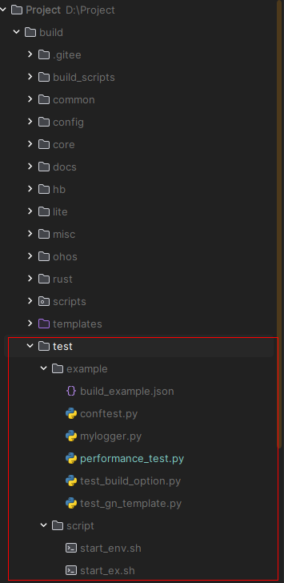
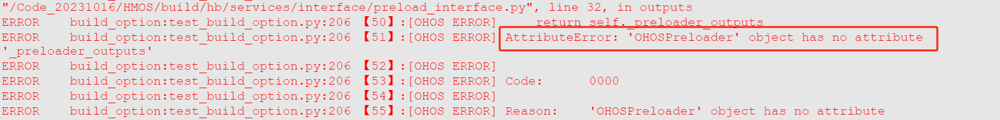

# 测试框架开发指导文档

## 整体目录结构

测试框架所在路径为root_path/build/test目录下（root_path为项目根路径）

## 目录介绍

**example**

      build_example.json 配置文件

      conftest.py pytest测试框架生成html配置文件，必须跟用例文件同路径

      mylogger.py 框架日志配置文件

      performance_test.py 性能测试脚本，使用python3 performance_test.py启动

      test_build_option.py 构建参数测试脚本，使用pytest命令启动

      test_gn_template.py 构建模板测试脚本，使用pytest命令启动

**script**

      start_env.sh 框架运行预安装模块文件
      
      start_ex.sh 流水线测试脚本启动文件

**test_example_template**

      include .h文件源码
      
      src .cpp文件源码
      
      others 其余均为gn测试用例

## 3.框架介绍

### 1.预安装

测试用例脚本启动前，先调用start_env.sh完成框架运行所需模块

### 2.启动
其他脚本调用start_ex.sh启动脚本时，按需传参:

      1、start_ex.sh option 只执行构建选项测试用例
      2、start_ex.sh template 只执行构建模板测试用例
      3、start_ex.sh performance 只执行性能测试
      4、start_ex.sh all  先执行构建选项测试用例，再执行性能测试，其次再执行构建模板测试用例【顺序不能变】\
      5、生成的报告对应在path_to_ohos_root/out/test_report目录下

### 3.附录
3.1 **pytest命令各参数介绍**

   pytest -vs --html option_report_path  option_script_path

      -vs 生成详细报告
      --html option_report_path
      在对应路径下生成html文件，其中包括asset目录和对应的html文件，注意：asset和html文件必须在同路径
      option_script_path pytest要执行的测试用例文件

3.2 **build_example.json文件介绍**

   

## 4.FAQ

### 4.1 Build_option 中 \--strict-mode=True参数构建失败

###### 问题描述：

example/test_build_option.py::TestBuildOption::test_strict_mode\[True\]测试用例失败，测试结果如下

###### Error

###### 问题原因:

源码 build/hb/services/interface/preload_interface.py第32行_preloader_outputs方法未实现，代码片段如下

### 4.2 Build_option 中\--scalable-build=True参数构建失败

###### 问题描述

example/test_build_option.py::TestBuildOption::test_scalable_build\[True\]测试用例失败，测试结果如下

###### Error:

###### 问题原因

源码build/hb/services/interface/preload_interface.py中字典platforms_info没有base_parts_config字段, platforms_info:
         
      {"phone": {
        
        "target_os": "ohos",
        
        "target_cpu": "arm",
        
        "toolchain": "//build/toolchain/ohos:ohos_clang_arm",
        
        "parts_config": "parts.json"
        
        } }

代码片段如下

### 4.3 Build_option 中\--rom-size-statistics=True参数构建失败

###### 问题描述

example/test_build_option.py::TestBuildOption::test_rom_size_statistics\[True\]测试用例失败，测试结果如下

###### 问题原因

源码build/hb/util/post_build/part_rom_statistics.py中read_ohos_config函数中ohos_config.json的绝对路径不正确，没有找到这个文件，导致build
error，代码片段如下

###### 修改建议

参考其它文件中ohos_config.json的路径以及ohos_config.json在项目中的路径，修改上图210行代码ohos_config.json绝对路径应该时{root_path}/out/ohos_config.json

