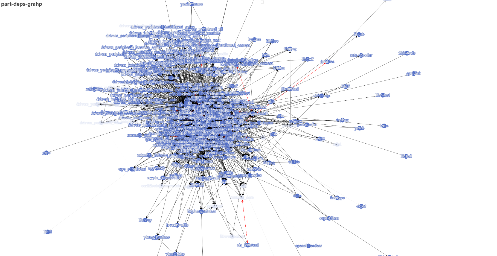
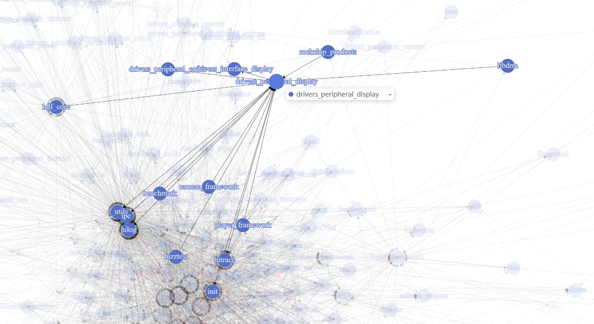
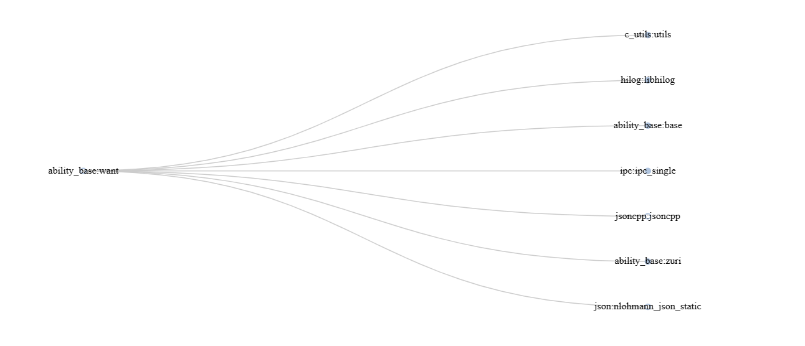
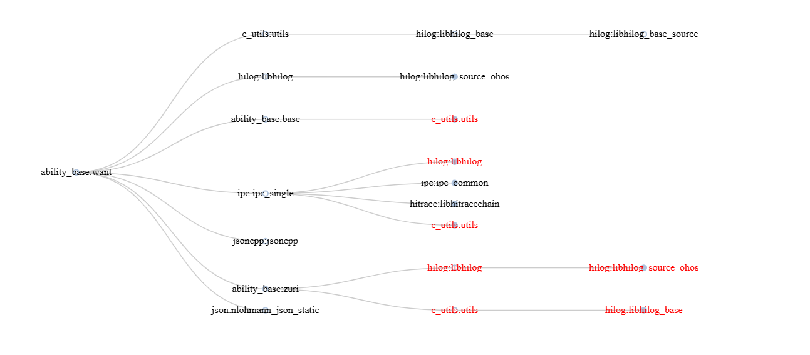
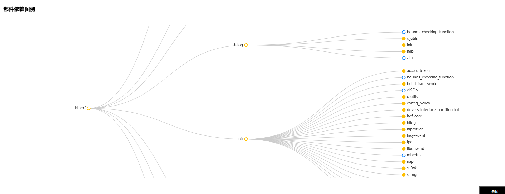

## 模块依赖分析


### 生成部件依赖

生成步骤：

1. 编译代码生成中间文件，只执行gn阶段，并打开check_deps属性

   ```shell
   ./build.sh --product-name product_name --ccache --gn-args pycache_enable=true --gn-args check_deps=true --build-only-gn 
   ```

   打开check_deps属性后，在输出产物目录下会生成out/{product_name}/deps_files目录，该目录下放置的是各个模块的依赖关系列表，以rk3568产品（下面都是以该产品为例进行举例）的目标//foundation/ability/ability_runtime/test/mock/services_abilitymgr_test/libs/aakit:aakit_mock为例，生成的依赖文件如下，包含了deps和external_deps以及该模块所在的路径。

   ```
   {
     "deps": [
       "//foundation/ability/ability_runtime/interfaces/inner_api/app_manager:app_manager",
       "//foundation/systemabilitymgr/safwk/interfaces/innerkits/safwk:system_ability_fwk",
       "//foundation/systemabilitymgr/samgr/interfaces/innerkits/samgr_proxy:samgr_proxy",
       "//third_party/jsoncpp:jsoncpp"
     ],
     "external_deps": [
       "ability_base:base",
       "ability_base:configuration",
       "ability_base:session_info",
       "ability_base:want",
       "bundle_framework:appexecfwk_base",
       "bundle_framework:appexecfwk_core",
       "c_utils:utils",
       "ffrt:libffrt",
       "hilog:libhilog",
       "ipc:ipc_core"
     ],
     "module_label": "//foundation/ability/ability_runtime/test/mock/services_abilitymgr_test/libs/aakit:aakit_mock(//build/toolchain/ohos:ohos_clang_arm)",
     "part_name": "ability_runtime"
   }
   ```

   上述的依赖关系与该模块的BUILD.gn文件是对应的：

   ```
   ohos_source_set("aakit_mock") {
     sources = [
       "src/ability_scheduler.cpp",
       "src/mock_ability_connect_callback.cpp",
     ]
   
     configs = [ ":aakit_mock_config" ]
     cflags = []
     if (target_cpu == "arm") {
       cflags += [ "-DBINDER_IPC_32BIT" ]
     }
     deps = [
       "${ability_runtime_innerkits_path}/app_manager:app_manager",
       "${distributedschedule_path}/safwk/interfaces/innerkits/safwk:system_ability_fwk",
       "${distributedschedule_path}/samgr/interfaces/innerkits/samgr_proxy:samgr_proxy",
       "//third_party/jsoncpp:jsoncpp",
     ]
     external_deps = [
       "ability_base:base",
       "ability_base:configuration",
       "ability_base:session_info",
       "ability_base:want",
       "bundle_framework:appexecfwk_base",
       "bundle_framework:appexecfwk_core",
       "c_utils:utils",
       "ffrt:libffrt",
       "hilog:libhilog",
       "ipc:ipc_core",
     ]
   
     subsystem_name = "ability"
     part_name = "ability_runtime"
   }
   ```

   可以看出，上面的模块依赖关系里面已经包含了三分部件的依赖关系。

2. 运行依赖生成脚本

   ```shell
   # 比如在源码根目录下执行
   build/tools/module_dependence/part_deps.py --deps-files-path out/{product_name}/deps_files
   ```

   基于产生的模块依赖关系，运行上述的脚本，会生成模块依赖关系文件和部件间的依赖关系文件，如果加上--graph参数，会生成依赖图。

3. 脚本参数说明

   ```
   --deps-files-path  # 必选  模块依赖数据文件目录，gn执行完成后输出在out/{product_name}/deps_files目录下，如果不在源码目录执行，需要配置到正确的路径。
   --graph            # 可选  生成部件依赖图。使用该选项，需要安装对应的库pyecharts
   ```

4. 关于依赖图的生成

   如果需要生成部件依赖图，使用--graph参数指定；本地机器需要安装依赖库：pyecharts

   ```
   # 使用pip安装python3的依赖库
   pip3 install pyecharts
   
   # 如果pip3没有安装，请先安装pip3
   sudo apt install python3-pip
   ```

5. 输出

   脚本运行后会在 `--deps-files-path` 指定的deps_files的同级目录下，创建parts_deps_info文件夹输出结果数据。
   parts_deps_info：

   ```
   parts_deps_info/all_deps_data.json       # 生成的模块依赖信息
   parts_deps_info/part_deps_info.json      # 生成的部件依赖
   parts_deps_info/part-deps-grahp.html     # 生成的部件依赖图，只有指定--graph参数时才生成
   ```

**图1** 所有部件依赖关系图



**图2**  单个部件的依赖关系




将指针悬停在单个部件上，可以查看单个部件的依赖状况。

### 生成模块依赖


生成步骤：

1. 编译代码生成中间文件，只执行gn阶段，并打开check_deps属性

   ```shell
   ./build.sh --product-name product_name --ccache --gn-args pycache_enable=true --gn-args check_deps=true --build-only-gn 
   ```

   打开check_deps属性后，运行上述脚本，在out目录下会生成out/{product_name}/deps_files文件。该文件下列表以模块的粒度铺开，描述了各个模块之间的依赖关系列表。

2. 运行依赖生成脚本

   ```shell
   # 比如在源码根目录下执行
   build/tools/module_dependence/module_deps.py --deps-files-path out/{product_name}/deps_files
   ```

   运行module_deps.py脚本，并传入上面的模块依赖关系列表，将生成module_deps_info文件，该文件下会描述模块之间的依赖关系。

3. 脚本参数说明

   ```
   --deps-files-path  # 必选  模块依赖数据文件目录，gn执行完成后输出在out/{product_name}/deps_files目录下，如果不在源码目录执行，需要配置到正确的路径。
   ```

4. 输出

   脚本运行后会在 `--deps-files-path` 指定的deps_files的同级目录下，创建module_deps_info文件夹输出结果数据。

   ```
   module_deps_info/all_deps_data.json        # 生成的模块依赖信息
   module_deps_info/module_deps_info.json     # 生成的模块依赖
   ```

   all_deps_data.json中的文件,以模块ability_base:want为例，会输出模块的deps和external_deps信息。

   ```
     "ability_base:want": {
       "deps": [
         "//foundation/ability/ability_base:base",
         "//foundation/ability/ability_base:zuri",
         "//third_party/json:nlohmann_json_static",
         "//third_party/jsoncpp:jsoncpp"
       ],
       "external_deps": [
         "c_utils:utils",
         "hilog:libhilog",
         "ipc:ipc_single"
       ],
       "module_label": "//foundation/ability/ability_base:want(//build/toolchain/ohos:ohos_clang_arm)",
       "part_name": "ability_base",
       "external_deps_label": [
         "//commonlibrary/c_utils/base:utils(//build/toolchain/ohos:ohos_clang_arm)",
         "//base/hiviewdfx/hilog/interfaces/native/innerkits:libhilog(//build/toolchain/ohos:ohos_clang_arm)",
         "//foundation/communication/ipc/interfaces/innerkits/ipc_single:ipc_single(//build/toolchain/ohos:ohos_clang_arm)"
       ]
     },
   ```

   module_deps_info.json的文件中，会将deps和external_deps进行合并。

   ```
     "ability_base:want": [
       "c_utils:utils",
       "hilog:libhilog",
       "ability_base:base",
       "ipc:ipc_single",
       "jsoncpp:jsoncpp",
       "ability_base:zuri",
       "json:nlohmann_json_static"
     ],
   ```

   

5. 生成单个模块的依赖树

   (1) 依赖pyecharts组件，需要安装:

      ```
   pip3 install pyecharts
      ```

   (2) 生成命令：

      ```
   # 比如在源码根目录下执行
   build/tools/module_dependence/module_deps_tree.py --module-name 部件名:模块名 --module-deps-file out/{product_name}/module_deps_info/module_deps_info.json
      ```

   (3) 参数说明：

      ```
   --module-name        # 必选 要生成模块的名称，结构为"部件名:模块名"
   --module-deps-file   # 必选 模块依赖信息文件module_deps_info.json所在路径
      ```

   (4) 输出:

      脚本运行后会在module_deps_info.json的同级目录下输出模块依赖树图

      ```
   module_deps_info/部件名__模块名.html
      ```

   用浏览器打开这个文件，会展示模块依赖树，默认展开第一层依赖。实心点表示一个模块还有未展开的其它模块依赖，点击实心点可以展开它的依赖。一个模块第一次出现时显示为黑色，之后出现显示为红色。

**图3**  单个模块的依赖关系（展开前）

  

**图4**  单个模块的依赖关系（展开后）




**注意：**
*工具能力在完善中，使用脚本和步骤会随时变化。*


### 门禁CI部件依赖关系（含三方部件）

门禁的依赖关系基于上述工具生成，打开单个部件可以看出包含了各子系统部件以及三方部件的依赖列表。

   **图5**  CI门禁上部件的依赖关系

   

门禁CI上依赖关系：http://ci.openharmony.cn/workbench/coding/codeInsight/part
